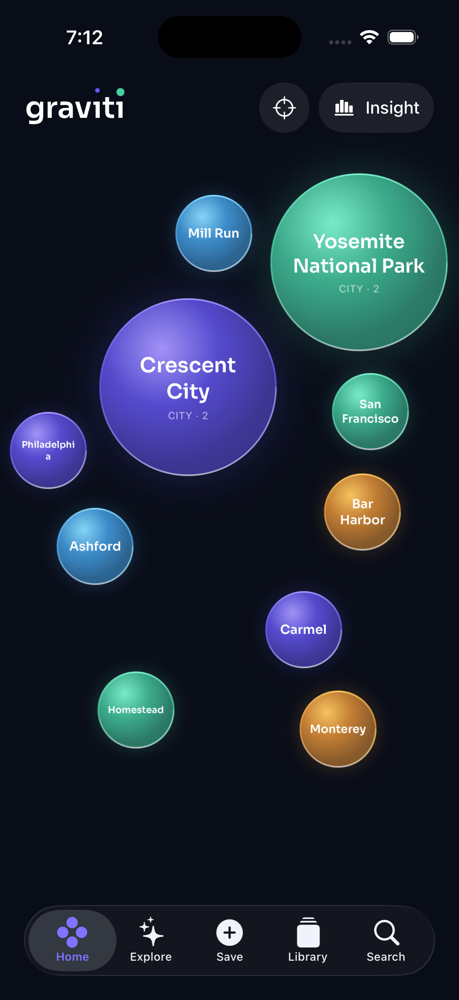
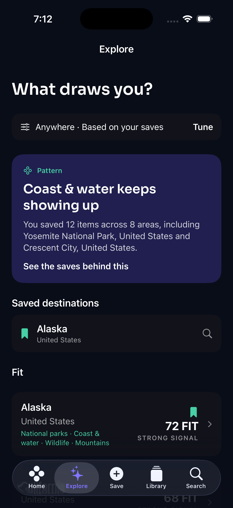
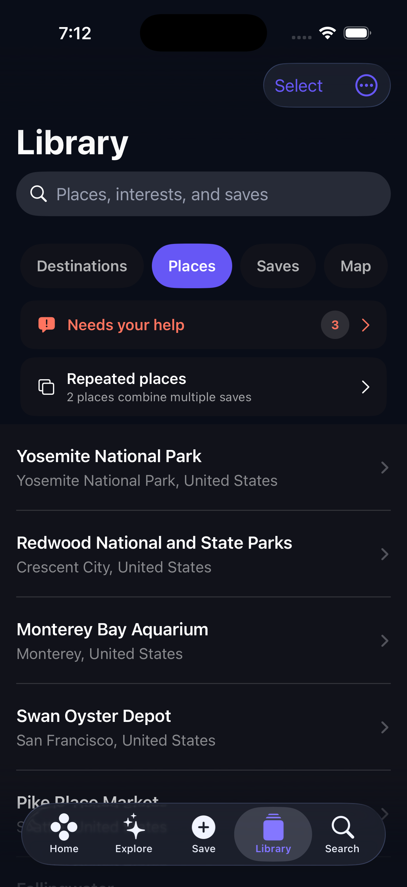
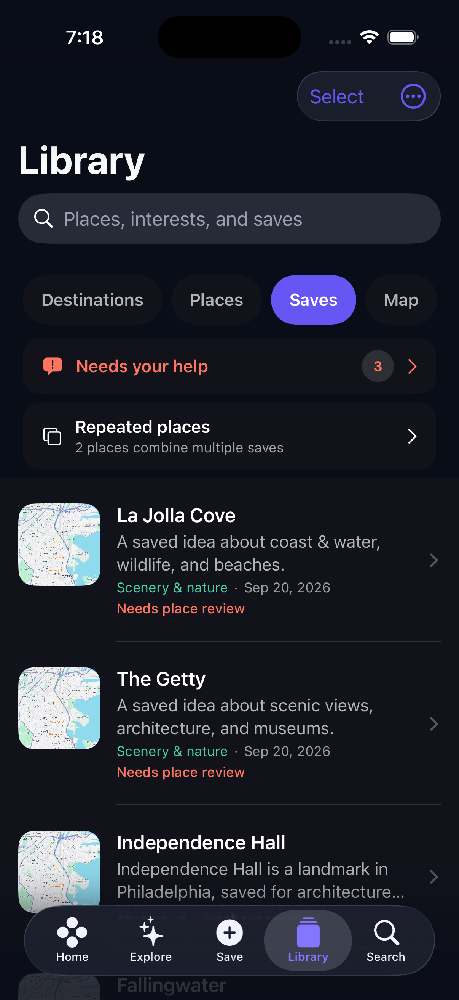

# Graviti

Graviti is a private, local-first iOS travel-interest library. Save places, links, notes, photos, screenshots, Apple Maps guides, shared Google Maps lists, or Google Maps exports. Graviti preserves the source, organizes it by geography and interest, shows where your saves have the most Gravity, and turns recurring patterns into destination Fit recommendations and actionable Fit Guides.

> **Save what pulls you.**

## Local MVP status

The local MVP is complete and verified. It requires no account or Graviti server. The Library is stored on the device and can be exported as a versioned backup. External distribution through TestFlight or the App Store is optional future work and is outside the local MVP completion goal.

### Implemented capabilities

- In-app capture for web links, manual notes, photos, screenshots, and Map links
- iOS Share Extension for URLs, text, and one image with an optional note
- Direct import from public Apple Maps guide links and shared Google Maps list links
- Google Takeout Saved CSV and Apple/Google `.webloc` import
- Immediate local persistence followed by resumable place resolution, OCR, link preview fetching, and enrichment
- Editable descriptions, categories, interests, notes, place matches, and source collection history
- Fine-grained semantic interests with per-interest source provenance and confidence
- Library browsing by Destinations, Places, Saves, and Map
- Individual deletion, atomic bulk save deletion, and bulk place-association removal
- Global local search plus live Apple MapKit place search
- Backward-compatible JSON backup and restore, including saved image bytes and Explore recommendation state
- Adaptive Gravity Field with country, state/province, and city resolution
- Direct switching between visible Gravity bubbles and semantic geographic drill-down
- A browsable Gravity Insights carousel for recent momentum, geographic splits, recurring interests, and quiet destinations
- Destination Readiness bands that discount duplicate saves and explain whether the current variety supports a weekend or several days
- Decorative white and yellow pulsing stars that respect Reduce Motion
- Explainable interest patterns, conservative Fit scoring, personal-evidence confidence, reviewed destination-knowledge confidence, preferences, “Not for me,” and reversible visited feedback
- Fit Guides with region-bound live suggestions grouped by the patterns behind a recommendation
- Persistent Fit Guide membership without duplicating an existing saved place
- Sora typography, Spanish localization, Dynamic Type, VoiceOver, increased contrast, RTL inspection, and conventional alternatives to the spatial UI
- Debug-only focused and crowded dogfood datasets

See [Complete Capability Reference](docs/CAPABILITIES.md) for workflows, data behavior, network use, limitations, and verification details.

## Screenshots

| Gravity Field | Explore |
| --- | --- |
|  |  |

| Places | Saves |
| --- | --- |
|  |  |

## Documentation

- [Complete Capability Reference](docs/CAPABILITIES.md)
- [Product Specification](docs/PRODUCT_SPEC.md)
- [Implemented Architecture](docs/ARCHITECTURE.md)
- [Implemented Data Model](docs/DATA_MODEL.md)
- [MVP Steering and Roadmap](docs/MVP_STEERING.md)
- [Post-MVP Roadmap](docs/POST_MVP_ROADMAP.md)
- [MVP Release Audit](docs/MVP_RELEASE_AUDIT.md)
- [Privacy Policy](docs/PRIVACY.md)
- [Optional TestFlight Preparation](docs/TESTFLIGHT.md)
- [Dogfood Datasets](test-data/dogfood/README.md)

## Project structure

```text
graviti/
├── graviti/                  iOS application
│   ├── App/                  composition and ArtifactLibrary facade
│   ├── Data/                 SwiftData persistence and repositories
│   ├── DesignSystem/         color, typography, copy, and wordmark
│   ├── Domain/               models, importers, scoring, search, and enrichment
│   ├── Features/             Home, Explore, Save, Library, Search, Onboarding
│   ├── Integrations/         MapKit and Share Extension support
│   └── Resources/            Sora fonts and Debug dogfood fixtures
├── GravitiShareExtension/    iOS Share Extension target
├── gravitiTests/             deterministic unit and integration coverage
└── graviti.xcodeproj/
docs/                         product, capability, architecture, and release docs
scripts/                      archive verification and optional export tools
test-data/dogfood/            source CSV fixtures for focused testing
```

## Requirements

- macOS with Xcode 26.2 or newer
- iOS 18.0 or newer simulator or device
- Apple development signing for physical-device and Share Extension testing
- Network access for MapKit, public Maps collection imports, and web link previews

## Build

Open `graviti/graviti.xcodeproj`, select the `graviti` scheme, and run on an iPhone simulator.

```sh
DEVELOPER_DIR=/Applications/Xcode.app/Contents/Developer \
xcodebuild \
  -project graviti/graviti.xcodeproj \
  -scheme graviti \
  -sdk iphonesimulator \
  -configuration Debug \
  -destination 'generic/platform=iOS Simulator' \
  -derivedDataPath /tmp/graviti-derived \
  CODE_SIGNING_ALLOWED=NO build
```

## Tests

The shared `graviti` scheme includes `gravitiTests`. Run **Product → Test** in Xcode or use an installed simulator destination with `xcodebuild test`.

The current suite contains 95 tests. It covers import parsing and migration, Fit relevance and confidence, reversible visited feedback, versioned destination-catalog validation and motif generalization, region-scoped Fit Guide search behavior, fine-grained semantic evidence, interest profiles, adaptive geographic resolution, deterministic crowded layouts, Gravity Insights, Destination Readiness, backup validation and media round trips, backup v1 and v2 compatibility and v3 Explore-state restoration, OCR, safe link metadata fetching, place resolution, bulk deletion, retry behavior, and SwiftData persistence.

The latest verified runs passed all 95 tests on iOS 18.6 and iOS 26.2. See [MVP Release Audit](docs/MVP_RELEASE_AUDIT.md) for the exact evidence and commit boundaries.

## Test data

Debug builds expose a dataset switcher at the bottom of Save. Loading a fixture replaces only the previously tracked test fixture, so real Library items remain intact. Release archives exclude the CSV fixtures and unused Sora weights. The source datasets are documented in [test-data/dogfood/README.md](test-data/dogfood/README.md).

## Data ownership

Graviti stores its Library locally and has no account, analytics SDK, advertising SDK, or Graviti-operated backend in the MVP. Library → Actions can export and restore a versioned JSON backup containing saved records, generated details, place matches, source collection membership, cached link details, image bytes, Explore preferences, saved destinations, Not for Me exclusions, and visited feedback. Uninstalling the app removes the local Library unless the user exports a backup first.
